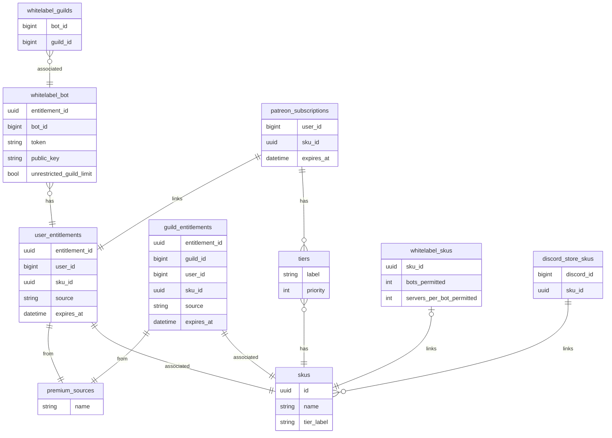

# Entitlements
The following entity relationship diagram describes the entities and relationships required to store both user and
server entitlements, with associated metadata, which are sourced from Patreon, Discord, voting and keys.

